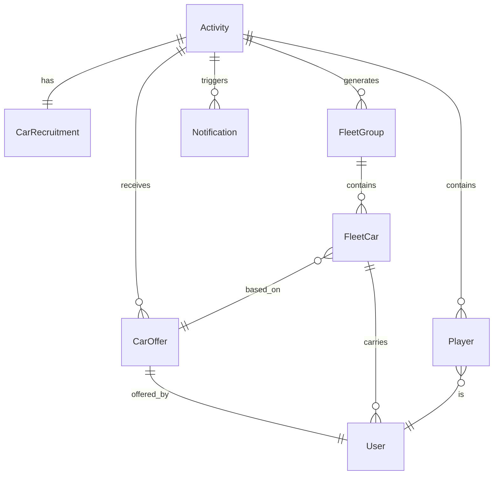

## 1. 架构设计

```mermaid
flowchart TB
    subgraph "前端层"
        "React 18 + TailwindCSS + Vite"
        "React Router v6"
        "Zustand 状态管理"
        "Framer Motion 动画"
    end
    subgraph "数据层"
        "Mock 数据 (JSON)"
        "LocalStorage 持久化"
    end
    subgraph "工具层"
        "日期处理: date-fns"
        "地图: 模拟地图组件"
        "分享: Canvas 截图生成"
    end
    "React 18 + TailwindCSS + Vite" --> "React Router v6"
    "React 18 + TailwindCSS + Vite" --> "Zustand 状态管理"
    "React 18 + TailwindCSS + Vite" --> "Framer Motion 动画"
    "Zustand 状态管理" --> "Mock 数据 (JSON)"
    "Zustand 状态管理" --> "LocalStorage 持久化"
    "React 18 + TailwindCSS + Vite" --> "日期处理: date-fns"
    "React 18 + TailwindCSS + Vite" --> "地图: 模拟地图组件"
    "React 18 + TailwindCSS + Vite" --> "分享: Canvas 截图生成"
```

## 2. 技术说明

- **前端**：React 18 + TailwindCSS 3 + Vite
- **初始化工具**：Vite（React + TypeScript 模板）
- **后端**：无（纯前端，使用 Mock 数据 + LocalStorage）
- **数据库**：无后端数据库，前端 Mock 数据 + LocalStorage 持久化
- **状态管理**：Zustand
- **动画库**：Framer Motion
- **路由**：React Router v6
- **日期处理**：date-fns
- **字体**：ZCOOL QingKe HuangYou（标题）、Noto Sans SC（正文）

## 3. 路由定义

| 路由 | 用途 |
|------|------|
| / | 首页 - 同城活动流、搜索筛选 |
| /activity/:id | 活动详情页 - 剧本信息、车源招募、玩家列表 |
| /create | 创建活动页 - 基本信息 + 车源招募配置 |
| /car-offer/:activityId | 车源响应页 - 车主填写出车信息 |
| /fleet/:activityId | 车队分组页 - 去程/返程车队名单、一键分享 |
| /checkin/:activityId | 打卡通知页 - 集合打卡、变更通知、消息流 |
| /profile | 个人中心 - 我的活动、我的车源 |

## 4. API 定义

本项目为纯前端应用，使用 Mock 数据模拟 API。核心数据结构如下：

```typescript
interface Activity {
  id: string
  title: string
  scriptName: string
  scriptType: string
  storeName: string
  storeAddress: string
  startTime: string
  playerCount: number
  currentPlayers: number
  organizer: User
  carRecruitment: CarRecruitment
  players: Player[]
  carOffers: CarOffer[]
  fleetGroups: FleetGroup[]
  status: 'recruiting' | 'confirmed' | 'in_progress' | 'completed'
  deadline: string
  isFriendsOnly: boolean
  notes: string
  createdAt: string
}

interface CarRecruitment {
  carsNeeded: number
  seatsPerCar: number
  fuelSubsidy: number
  allowPickup: boolean
}

interface CarOffer {
  id: string
  activityId: string
  driver: User
  pickupArea: string
  availableSeats: number
  waitAfterGame: boolean
  status: 'pending' | 'confirmed' | 'cancelled'
  notes: string
  createdAt: string
}

interface FleetGroup {
  id: string
  activityId: string
  type: 'outbound' | 'return'
  cars: FleetCar[]
  meetingPoint: string
  departureTime: string
}

interface FleetCar {
  carOfferId: string
  driver: User
  passengers: User[]
  route: string
}

interface User {
  id: string
  nickname: string
  avatar: string
  isCarOwner: boolean
}

interface Player {
  user: User
  checkinStatus: 'not_arrived' | 'arrived' | 'late'
  carOfferId?: string
  assignedCarId?: string
}

interface Notification {
  id: string
  activityId: string
  type: 'car_offer' | 'checkin' | 'change' | 'late' | 'ride_change'
  content: string
  user: User
  timestamp: string
}
```

## 5. 服务器架构图

不适用（纯前端项目，无后端服务）

## 6. 数据模型

### 6.1 数据模型定义



### 6.2 数据定义语言

本项目使用前端 Mock 数据，数据存储在 LocalStorage 中。初始化数据结构：

```json
{
  "activities": [],
  "users": [
    {
      "id": "u1",
      "nickname": "剧本杀小队长",
      "avatar": "avatar_1",
      "isCarOwner": true
    }
  ],
  "notifications": []
}
```
